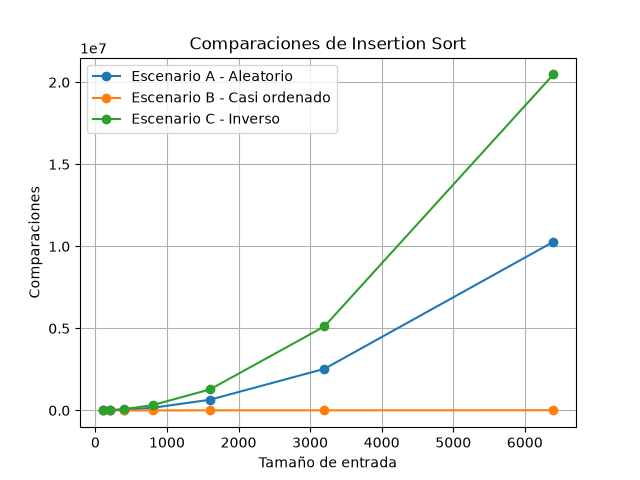
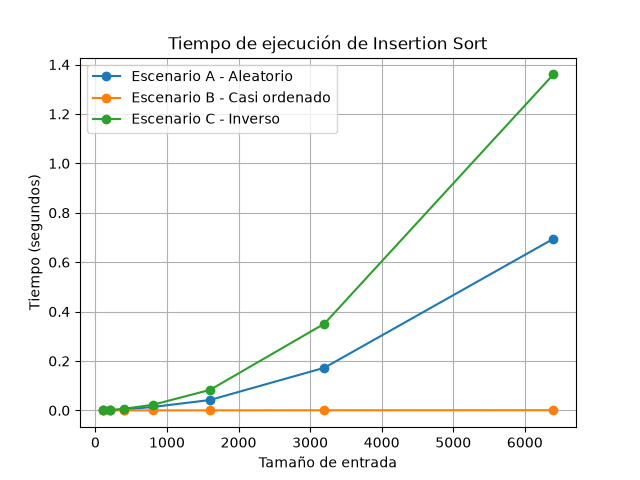
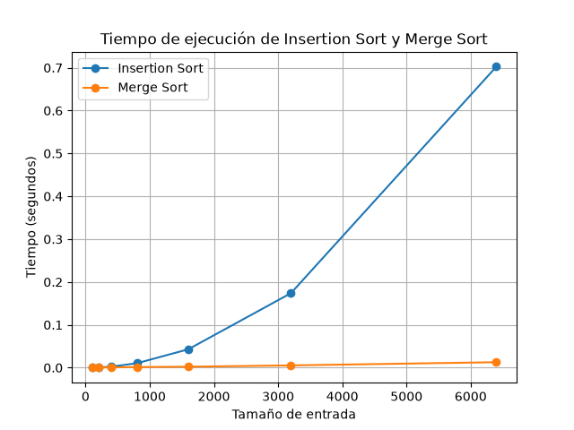

# Estudiante

Erian Jose Serna Marin

# Comandos 

Creación del entorno virtual 

```bash
python3 -m venv venv 
```

Después para activarlo se utiliza

```bash
venv\Scripts\activate
```

Con este comando instalamos las librerias

```bash
pip install -r requirements.txt
```

Nos ubicamos en la carpeta donde está el ejercicio
```bash
cd \lab1-fundamentos-complejidad-recurrencias\    
```

### Ejecución de los experimentos

Para ejecutar el experimento de la Parte 3:

```bash
python parte3_casos.py
```

Para ejecutar el experimento de la parte 4:

```bash
python parte4_complejidad.py
```

# Solución parte #1

### Distinga explícitamente entre corrección (el ordenamiento que produce Tamiza es el correcto) y eficiencia (lo produce dentro de la ventana de cuatro horas), y explique por qué la primera no implica la segunda. Nombre la restricción concreta que el sistema incumple.

 R// El hecho de que Insertion Sort haya funcionado durante ocho años no significa que siga siendo adecuado para las condiciones actuales de Tamiza. El algoritmo es correcto porque logra ordenar los 1.200.000 registros según el índice de riesgo como se necesita, pero eso no garantiza que pueda hacerlo en un tiempo aceptable. En este caso, la eficiencia se debe analizar principalmente con respecto al tiempo disponible, ya que el proceso tiene una ventana estricta de cuatro horas, entre las 2:00 am y las 6:00 am Si el algoritmo termina después de las 6:00 am, aunque la lista esté correctamente ordenada, el sistema no cumple con lo que necesita el proceso.

# 

### Explique por qué duplicar la velocidad del servidor no resuelve el problema de fondo.

R// Duplicar la velocidad del servidor podría reducir el tiempo de ejecución de alguna forma, pero no solucionaría el problema del todo. El problema está relacionado con la cantidad de registros que debe procesar el algoritmo y con la forma en que aumenta su trabajo cuando crece el tamaño de lo que le entra.

 Tamiza pasó de manejar unos 20.000 registros a 1.200.000, por lo que el crecimiento de los datos es más que una mejora en la velocidad del equipo. Comprar un servidor más rápido sería una solución basada en hardware que podría dar una ayuda temporal, pero el algoritmo seguiría teniendo el mismo comportamiento y podría volver a superar el rango de cuatro horas si la cantidad de registros va a seguir aumentando.

#

### Incluya un segundo ejemplo, propio y distinto de Tamiza, en el que un algoritmo correcto resulta inviable: un sistema que usted use, conozca o haya programado. Un ejemplo es concreto cuando indica qué se procesa, aproximadamente cuántos datos hay y qué restricción se incumple (una ventana de tiempo, una latencia máxima, una capacidad de memoria).

R// Un ejemplo diferente podría ser un sistema del ITM encargado de contar cuántas motos y carros ingresan a la institución durante el día mediante cámaras ubicadas en la porteria de vehiculos. Supongamos que el sistema debe procesar alrededor de 200.000 registros diarios y entregar el conteo al finalizar la jornada. El algoritmo podría realizar correctamente el conteo, pero si tarda más de las dos horas disponibles para procesar la información, el resultado no estaría listo cuando se necesita. En este caso, el algoritmo sería correcto porque entrega el resultado esperado, pero no sería viable para el sistema debido a la restricción de tiempo.

#

# Solución parte #2

### Dimensión ambiental: explique cómo el tiempo de ejecución del proceso nocturno se traduce en consumo energético, y por qué ese consumo se multiplica cuando el proceso corre todas las madrugadas durante años.

R// Al elegir el algoritmo de Tamiza la responsabilidad ambiental para este caso es que el tiempo de ejecución tiene relación con los recursos que utiliza el servidor. Si el algoritmo tarda más en ordenar los 1.200.000 registros, el equipo debe permanecer trabajando durante más tiempo para completar el proceso. Aunque pareciera una diferencia pequeña en una sola madrugada, no lo es ya que tamiza realiza este proceso todos los días durante años, por lo que el consumo de esas ejecuciones se acumula. Por eso, elegir un algoritmo que pueda hacer el mismo trabajo en menos tiempo no solo tiene un impacto en el rendimiento del sistema, sino también en el uso de energía que requiere mantenerlo funcionando.

#

### Dimensión ética: identifique al menos dos formas concretas en que la lentitud o el fallo de este algoritmo perjudica a una persona identificable. Para cada una, responda explícitamente: ¿quién asume el costo del error? ¿El paciente, el operador del centro de contacto, la Secretaría, el equipo de desarrollo?

R// El primer afectado puede ser el operador del centro de contacto, ya que si el proceso no termina a tiempo puede recibir una lista incompleta o desordenada y tener que trabajar con información que no está preparada para realizar las llamadas. En este caso, el costo del error lo asume el operador mediante una mayor carga de trabajo y tiempo adicional.

El segundo afectado es el paciente. Como la lista se organiza según el índice de riesgo, un error en el ordenamiento puede hacer que un paciente con un riesgo mayor quede después de otros pacientes con un riesgo menor. Esto puede retrasar su contacto para una valoración médica. En este caso, el costo del error lo asume el paciente, porque puede recibir la atención o el contacto más tarde de lo que correspondía según la prioridad establecida por el sistema.

#

### Discuta brevemente una tensión propia de este caso: el orden de la lista decide a quién se llama primero. ¿Qué obligación adicional impone eso sobre la corrección del ordenamiento, más allá del tiempo?

R// Existe una responsabilidad adicional porque el orden de la lista determina a quién se contacta primero. No se trata solamente de conseguir una lista ordenada antes de las 6:00 am, sino de garantizar que realmente esté ordenada de mayor a menor riesgo. Si el algoritmo produce un orden incorrecto, puede cambiar la prioridad con la que se contacta a los pacientes. Por esto, la decisión debe garantizar que el algoritmo termine dentro del tiempo y que el resultado sea correcto, ya que en este caso el ordenamiento tiene una consecuencia directa sobre la atención de las personas.

#

# Parte 3 - Peor caso, mejor caso y caso promedio, demostrados en Python

Codigo de la parte 3: [parte3_casos.py](parte3_casos.py)

Algoritmo utilizado: [algoritmos.py](algoritmos.py) (Insertion_Sort)

Logica utilizada: [datos.py](datos.py)

# Punto 3.1 - Explicación

### Defina peor caso, mejor caso y caso promedio indicando, para cada uno, sobre qué se toma el máximo, el mínimo o el promedio: ¿sobre qué conjunto de entradas, y con qué tamaño fijo? No basta con decir "el caso malo".

R// Para una entrada de tamaño fijo n, se consideran todas las entradas posibles que cumplen con ese tamaño. El peor caso es la entrada de ese conjunto que requiere la mayor cantidad de operaciones para ser procesada. El mejor caso es la entrada que requiere la menor cantidad de operaciones. El caso promedio corresponde al promedio del comportamiento del algoritmo sobre las entradas posibles de tamaño n.

En este laboratorio, por ejemplo, si n = 1.000, se compararían los comportamientos de las diferentes listas posibles de 1.000 registros. No se están comparando una lista de 1.000  con otra de 2.000, sino que el tamaño de la entrada se mantiene fijo y se analiza cuánto trabajo realiza el algoritmo dependiendo del orden.

#

### Responda de forma justificada: ¿cuál de los tres casos usaría para decidir si el algoritmo de Tamiza entra en producción, sabiendo que la ventana de cuatro horas es estricta, y por qué?

R// Para yo saber decidir cual de los 3 casos puede entrar en producción usaría el peor caso, porque la ventana de cuatro horas es una restricción estricta. Los 1.200.000 registros deben estar ordenados antes de las 6:00 am, por lo que no sería suficiente que el algoritmo funcione dentro del tiempo cuando los datos se encuentran en una situación favorable.

Si usamos el peor caso, eso nos ayuda a saber cuánto puede demorar el algoritmo cuando la entrada requiere la mayor cantidad de trabajo. Si en ese escenario supera las cuatro horas, está riesgo de que el proceso no termine a tiempo cuando los datos lleguen en un orden poco conveniente. Por eso, para una condición de producción con un tiempo límite estricto, es mejor garantizar que el algoritmo pueda cumplir la restricción hasta en el peor escenario.

#

### Prediga, antes de medir, qué caso de análisis representa cada escenario de Tamiza para insertion sort: ¿el escenario A, el B o el C es su peor caso? ¿Cuál su mejor caso? Escriba la predicción en el informe y déjela ahí aunque el experimento la contradiga; si la contradice, explique por qué.

R// Mi predicción es que el escenario C es el peor caso, porque los registros están ordenados al contrario de como los necesita el algoritmo. Al ordenar de mayor a menor, cada elemento se va a desplazar muchas posiciones.

El escenario B es el mejor caso o por lo menos el más cercano, porque el 98% de los registros ya se encuentra ordenado y solamente el 2% corresponde a registros nuevos agregados al final. Eso reduce la cantidad de movimientos.

Finalmente, el escenario A es el caso promedio, porque los registros se encuentran en un orden aleatorio y no presentan una condición favorable o desfavorable.

Entonces, la predicción antes de experimentar es: B = mejor caso, A = caso promedio y C = peor caso.

#

# 3.2 - Demostración experimental

Las gráficas obtenidas fueron las siguientes:



#



Al comparar los resultados, el **escenario C resultó ser el peor caso**, ya que presentó la mayor cantidad de comparaciones y el mayor tiempo de ejecución. Esto ocurre porque los datos están ordenados de forma contraria a como los necesita el algoritmo, por lo que los elementos deben desplazarse muchas posiciones.

El **escenario B resultó ser el mejor caso**, debido a que la mayor parte de los datos ya estaba ordenada y solamente una pequeña parte estaba desordenada al final. Por esto, el algoritmo necesitó menos comparaciones y el tiempo de ejecución fue mucho menor.

El **escenario A se aproxima al caso promedio**, ya que sus resultados quedaron entre los escenarios B y C. Al estar los datos en un orden aleatorio, el algoritmo realiza una cantidad intermedia de comparaciones.

#

### Comparación con la predicción

Los resultados obtenidos coinciden con la predicción realizada en el punto 3.1. Antes de realizar el experimento se planteo que B sería el mejor caso, A el caso promedio y C el peor caso.

Después de realizar las pruebas, se obtuvo el mismo comportamiento. El escenario C tuvo el mayor número de comparaciones y mayor tiempo, el escenario B tuvo los valores más bajos y el escenario A quedó entre los dos.

Por lo tanto, el experimento confirmó la predicción inicial.

#

# Parte 4 — Complejidad de merge sort e insertion sort: cálculo y validación

Código de la Parte 4: [parte4_complejidad.py](parte4_complejidad.py)

Algoritmo utilizado: [algoritmos.py](algoritmos.py) (Insertion_Sort & Merge_Sort)

Logica utilizada: [datos.py](datos.py)

# Punto 4.1 — Cálculo teórico

### Plantee la recurrencia de merge sort: T(n) = 2T(n/2) + Θ(n). Explique de dónde sale cada término del planteamiento (cuántos subproblemas, de qué tamaño, y cuál es el costo de combinar).

R// La recurrencia de Merge Sort es:

T(n) = 2T(n/2) + Θ(n)

Esta recurrencia representa el tiempo que tarda el algoritmo en ordenar una lista de tamaño n. El 2T(n/2) aparece porque la lista se divide en dos sublistas, y cada una tiene aproximadamente n/2 elementos. Después el Merge Sort ordena cada parte de forma recursiva.

El término Θ(n) corresponde al proceso de combinar las dos sublistas ya ordenadas. Para realizar esta combinación se reccoren los elementos de las dos partes y se colocan en el orden correcto. Por eso el costo de combinar crece de forma proporcional a n.

Cuando la lista llega a tener un solo elemento, ya está ordenada, por lo que ese es el caso base:

T(1) = Θ(1)

#


### Resuélvala con uno de los tres métodos vistos en clase —sustitución, árbol de recursión o método maestro— hasta obtener la cota final. Muestre el desarrollo paso a paso: 

Método elegido: método maestro


R//

T(n) = aT(n/b) + f(n)

a = 2

b = 2

f(n) = Θ(n)

Ahora calculamos:

n^(log_b(a))

Reemplazando los valores:

n^(log_2(2))

Como:

log_2(2) = 1

entonces:

n^1 = n

Por lo tanto:

n^(log_b(a)) = n

Ahora comparamos f(n) con n^(log_b(a)):

f(n) = Θ(n)

y

n^(log_b(a)) = n

Los dos tienen el mismo orden de crecimiento. Por lo tanto, se cumple la condición del caso 2 del método maestro:

f(n) = Θ(n^(log_b(a)))

La solución correspondiente es:

T(n) = Θ(n log n)

Por lo tanto, la complejidad temporal de Merge Sort es Θ(n log n).

#

### Calcule la cota de insertion sort de forma manual, línea a línea: indique cuántas veces se ejecuta cada línea de su implementación, sume los costos y explique el resultado.

R// Tomando n como el tamaño de la lista, el costo de las principales líneas de insertion_sort es:

| Línea                                  | Veces que se ejecuta |
| -------------------------------------- | -------------------: |
| `copia = datos.copy()`                 |                    1 |
| `comparaciones = 0`                    |                    1 |
| `for`                                  |              `n - 1` |
| `actual = copia[i]`                    |              `n - 1` |
| `j = i - 1`                            |              `n - 1` |
| `while`, comparación y desplazamientos |     Depende del caso |
| `copia[j + 1] = actual`                |              `n - 1` |
| `return`                               |                    1 |

En el mejor caso, la lista ya está ordenada de mayor a menor. El while realiza una comparación por cada elemento y termina inmediatamente:

1 + 1 + ... + 1 = n - 1

Por lo tanto:

T(n) = Θ(n)

En el peor caso, la lista está ordenada de menor a mayor y cada elemento debe desplazarse hasta el inicio. Las comparaciones son:

1 + 2 + 3 + ... + (n - 1)
= n(n - 1) / 2
= Θ(n²)

En el caso promedio, se realizan aproximadamente la mitad de los desplazamientos posibles, pero el crecimiento sigue siendo cuadrático:

T(n) = Θ(n²)

Resultado: Insertion Sort tiene complejidad Θ(n) en el mejor caso y Θ(n²) en el caso promedio y peor caso.

#

### Deje escrita, en una tabla, la complejidad esperada de cada algoritmo en el mejor, el peor y el caso promedio.

R// 

| Algoritmo | Mejor caso | Caso promedio | Peor caso |
|---|---|---|---|
| Insertion Sort | Θ(n) | Θ(n²) | Θ(n²) |
| Merge Sort | Θ(n log n) | Θ(n log n) | Θ(n log n) |

#

# 4.2 — Validación experimental

### Incruste la gráfica en el README.md y concluya, a partir de ella, cuál de los dos algoritmos es mejor para Tamiza y por qué: describa qué hace cada curva a medida que crece el tamaño de entrada.

R// 

En la gráfica se observa que Merge Sort presenta un menor tiempo de ejecución que Insertion Sort a medida que aumenta el tamaño de entrada. La curva de Insertion Sort crece rápidamente, especialmente en los tamaños más grandes, mientras que la de Merge Sort aumenta de forma más moderada y se mantiene con tiempos bajos.

Por lo tanto, para Tamiza conviene utilizar Merge Sort, ya que debe procesar una cantidad muy grande de registros y su tiempo de ejecución crece más lentamente cuando aumenta el tamaño de los datos.

# 

### Diga si esa conclusión coincide con las complejidades que calculó en 4.1. Si para los tamaños pequeños la gráfica muestra algo distinto de lo esperado, explíquelo en una o dos frases.

R// Sí, la conclusión coincide con las complejidades calculadas en el punto 4.1. Insertion Sort tiene una complejidad promedio de Θ(n²), mientras que Merge Sort tiene una complejidad de Θ(n log n), por lo que Merge Sort escala mejor cuando aumenta la cantidad de registros.

En los tamaños pequeños, las diferencias pueden ser menos notorias porque ambas cantidades de datos son reducidas y el costo adicional de dividir y combinar en Merge Sort puede influir en el tiempo.

#

# 4.3 — Concepto técnico a la Secretaría de Salud

### Recomiende explícitamente qué algoritmo debe ejecutar Tamiza, sabiendo que el canal de entrada puede cambiar sin aviso y que el equipo no quiere mantener tres implementaciones distintas. Justifique el criterio con el que resolvió ese compromiso.

R// Se recomienda utilizar merge sort para Tamiza. El criterio utilizado es buscar un algoritmo que tenga un comportamiento más estable cuando cambia el orden de los datos de entrada.

En las pruebas con Insertion Sort se observó que el orden de los datos afecta bastante su comportamiento. El escenario B tuvo pocas comparaciones porque los datos estaban casi ordenados, mientras que el escenario C tuvo muchas más comparaciones porque los datos estaban en el orden contrario. Por esta razón, no sería conveniente depender de que los datos siempre lleguen casi ordenados.

Además, en la gráfica parte4_tiempo.png se observa que merge sort mantiene tiempos mucho menores que Insertion Sort a medida que aumenta el tamaño de entrada. Por lo tanto, se recomienda mantener una sola implementación de merge sort para los diferentes tipos de entrada.

#

### Estime si el proceso cabe en la ventana de cuatro horas con 1.200.000 registros, para el algoritmo actual y para el que recomienda. Extrapole a partir de sus mediciones: explique el razonamiento de la extrapolación y declare que es una estimación, no una medición.

R// Para Insertion Sort se toma como referencia el escenario C con 6.400 registros, que tardó aproximadamente 1,27 segundos, según la gráfica parte3_tiempo.png. Como el comportamiento observado es cuadrático, al pasar de 6.400 a 1.200.000 registros se estima un tiempo de aproximadamente 12,4 horas.

Para merge sort, en la gráfica parte4_tiempo.png, con 6.400 registros se obtuvo aproximadamente 0,01 segundos. Considerando su crecimiento de aproximadamente n log(n), la extrapolación para 1.200.000 registros da aproximadamente 3 segundos.

Estos valores son estimaciones y no mediciones directas con 1.200.000 registros. La estimación indica que Insertion Sort no cumpliría la ventana de cuatro horas en el escenario desfavorable, mientras que merge sort estaría muy por debajo de ese límite.

#

### Responda de forma directa a la propuesta de comprar el servidor del doble de velocidad, apoyándose en un dato medido por usted (cite la gráfica y el tamaño de entrada del que lo tomó).

R// No se debería solucionar el problema solamente comprando un servidor con el doble de velocidad. En la gráfica parte3_tiempo.png, Insertion Sort tardó aproximadamente 1,27 segundos con 6.400 registros en el escenario C. Aunque duplicar la velocidad pudiera reducir el tiempo aproximadamente a la mitad, el crecimiento del algoritmo seguiría siendo un problema al trabajar con 1.200.000 registros.

La estimación realizada muestra aproximadamente 12,4 horas para Insertion Sort en el escenario C, por lo que mejorar solamente el hardware no sería suficiente para garantizar la ventana de cuatro horas.

#

### Discuta al menos una consideración distinta del tiempo puro: la memoria adicional que consume merge sort, la estabilidad del ordenamiento, el costo de mantener el código, o el riesgo de que el escenario B deje de ser casi ordenado si cambia el flujo de reproceso.

R//

También se debe considerar el mantenimiento del código. Tener diferentes algoritmos dependiendo del tipo de entrada aumentaría la complejidad del sistema. Además, el escenario B podría dejar de ser casi ordenado si cambia el flujo de reproceso o la forma en que llegan los registros.

Por esto, utilizar una sola implementación de merge sort permite evitar depender de que los datos lleguen en un orden específico y facilita el mantenimiento del sistema.