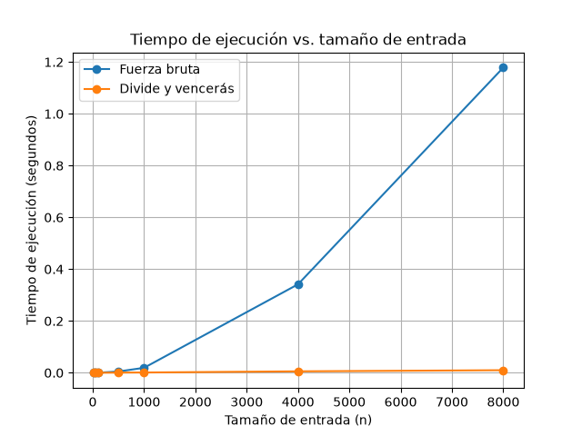

# Laboratorio evaluativo 02 — Dividir y vencer

## Estudiante

Erian Jose Serna Marin

## Instrucciones para reproducir el experimento

Creación del entorno virtual

```bash
python3 -m venv venv 
```

#

Para activarlo en windows se utiliza

```bash
venv\Scripts\activate
```

Para activarlo en linux se utiliza

```bash
source venv/bin/activate
```

#

Con este comando instalamos las librerias

```bash
pip install -r requirements.txt
```

#

Nos ubicamos en la carpeta donde está el ejercicio
```bash
cd lab2-divide-y-vencer
```

#

### Ejecución de los experimentos

Para ejecutar las pruebas de la parte 1:

```bash
python pruebas.py
```

Para ejecutar el experimento de la parte 2:

```bash
python medicion.py
```

#

## Parte 1 — Breve descripción de cómo verificó las soluciones y qué casos cubrió.

Codigo de la parte 1: [`subarreglo.py`](subarreglo.py)

Codigo de pruebas de la parte 1: [`pruebas.py`](pruebas.py)

Para verificar las dos soluciones se utilizaron pruebas con diferentes tipos de listas. Primero se comprobó la serie de ocho días planteada en la situación problema, cuya mejor racha tiene una suma de 17.

También se probaron casos de un solo elemento, listas cuyos valores son todos negativos, listas cuyos valores son todos positivos y un caso en el que la mejor racha cruza el punto medio. Finalmente, se utilizaron al menos veinte listas generadas aleatoriamente y se comprobó que la fuerza bruta y divide y vencerás obtuvieran la misma suma máxima.

Las pruebas se realizaron utilizando assert, por lo que si alguna condición no se cumple, la ejecución indica que existe un problema en la implementación.

#

## Parte 2 — La gráfica incrustada y una nota sobre cómo midió (por ejemplo, si repitió cada medición).

Código de [`medicion.py`](medicion.py)

Para las mediciones se utilizaron los tamaños `10, 50, 100, 500, 1000, 4000 y 8000`. Los datos fueron generados con una semilla fija (`42`) y con valores enteros entre `-100` y `100`.

Para cada tamaño se utilizó la misma lista de datos para los dos algoritmos. El tiempo se midió únicamente durante la ejecución de cada algoritmo utilizando `time.perf_counter()`, sin incluir la generación de los datos.

Cada medición se repitió cinco veces y se utilizó el promedio de los tiempos obtenidos. Además, en cada tamaño se comprobó mediante un `assert` que los dos algoritmos produjeran la misma suma máxima.

### Gráfica



#

## Parte 3 — Análisis.

## 1. Recurrencia
Plantee la recurrencia de su subarreglo_maximo explicando de dónde sale cada término (cuántos subproblemas, de qué tamaño, qué cuesta el caso cruzado) y resuélvala con el método maestro, verificando la condición del caso que aplica. Explique también por qué la fuerza bruta de la Parte 1 es Θ(n²).

### R// 

En subarreglo_maximo, el problema se divide en dos partes de aproximadamente n/2. Por eso aparecen dos subproblemas, cada uno con costo T(n/2). Después se busca el mejor tramo que cruza el punto medio. Este recorrido revisa los elementos de las dos mitades una sola vez, así que cuesta Θ(n).

Por lo tanto, la recurrencia es:

T(n) = 2T(n/2) + Θ(n)

Aplicando el método maestro, a = 2, b = 2 y f(n) = Θ(n). Como:

n^(log₂ 2) = n

f(n) tiene el mismo orden, por lo que corresponde al caso 2 del método maestro. Entonces:

T(n) = Θ(n log n)

La fuerza bruta, en cambio, utiliza dos ciclos para recorrer las diferentes posiciones inicial y final. Aunque la suma se va acumulando y no se recalcula desde cero, sigue habiendo un número cuadrático de combinaciones. Por eso su complejidad es Θ(n²).

#

## 2. Lo medido contra lo esperado
A partir de su gráfica, describa qué hace cada curva cuando el tamaño de entrada crece. Tome dos tamaños consecutivos en los que n se duplique y calcule cuánto se multiplicó el tiempo de cada algoritmo; diga si coincide con lo que predicen Θ(n²) y Θ(n log n).

### R// 

En la gráfica se nota que la fuerza bruta crece mucho más rápido a medida que aumenta n. Por ejemplo, al pasar de 4000 a 8000 elementos, su tiempo pasa aproximadamente de 0,34 s a 1,18 s, es decir, se multiplica por unas 3,5 veces. Teóricamente, al duplicar n en Θ(n²), esperaríamos un factor cercano a 4, así que el resultado está bastante cerca.

Para divide y vencerás, la curva se mantiene mucho más baja. En ese mismo aumento de 4000 a 8000, el tiempo aumenta aproximadamente de 0,004 s a 0,008 s, alrededor de 2 veces. Esto también tiene sentido con Θ(n log n), donde al duplicar n el tiempo debería aumentar un poco más de dos veces.

Las diferencias no son exactas porque se midió en tiempos reales y hay factores externos como el procesador y el sistema operativo.

#

## 3. Tamaños pequeños
Diga si en sus mediciones hay un tamaño a partir del cual divide y vencerás empieza a ganar. Si no lo hay en su rango, o si la ventaja aparece más tarde de lo que esperaba, explique por qué.

### R// 

En las mediciones, divide y vencerás ya aparece por debajo de fuerza bruta desde los tamaños más pequeños. Sin embargo, en esos tamaños la diferencia es muy pequeña y cuesta apreciarla en la gráfica.

Esto tiene sentido porque para listas pequeñas la ventaja de reducir el número de operaciones todavía no es tan importante y el costo adicional de hacer llamadas recursivas también influye. A medida que n crece, la diferencia se vuelve mucho más evidente.

#

## 4. ¿Cuándo conviene dividir? 
Compare con un problema distinto: hallar el máximo de un arreglo de n números. ¿Mejora dividirlo a la mitad frente a recorrerlo una vez? Justifique con el costo de combinar y la recurrencia resultante.

### R// 

Si solamente queremos encontrar el máximo de un arreglo, no conviene dividirlo. Se puede recorrer una vez y mantener el mayor valor encontrado, lo que cuesta Θ(n).

Si lo dividiéramos en dos, tendríamos la recurrencia:

T(n) = 2T(n/2) + Θ(1)

porque después de resolver las dos mitades solo necesitamos comparar sus dos máximos. Aunque esta recurrencia también da Θ(n), no mejora el recorrido directo y además agrega trabajo por las llamadas recursivas. Por eso dividir solo vale la pena cuando realmente aporta una ventaja al combinar o resolver los subproblemas.

#

## 5. Concepto para la gerente. 
Recomiende un algoritmo para la cooperativa y estime, a partir de su medición, cuánto tardaría cada uno con una serie de 1.000.000 de registros. Declare que es una estimación y explique el razonamiento (no use una regla de tres lineal).

### R// 

Para la cooperativa recomiendo divide y vencerás, especialmente pensando en las series de cientos de miles o millones de registros. La gráfica muestra que la fuerza bruta crece mucho más rápido.

Tomando como referencia los 8000 elementos, la fuerza bruta tarda aproximadamente 1,18 s. Si hacemos una estimación usando su crecimiento cuadrático:

1,18 × (1.000.000 / 8.000)² ≈ 18.438 s

Eso equivale aproximadamente a 5,1 horas.

Para divide y vencerás, tomando aproximadamente 0,008 s en 8000 elementos y considerando su crecimiento n log n, la estimación para un millón de elementos es de alrededor de 1,5 segundos.

Estos valores son estimaciones, no tiempos garantizados, porque estamos extrapolando los resultados de una medición pequeña a una entrada mucho mayor. Aun así, muestran claramente por qué para volúmenes grandes conviene usar divide y vencerás.

#